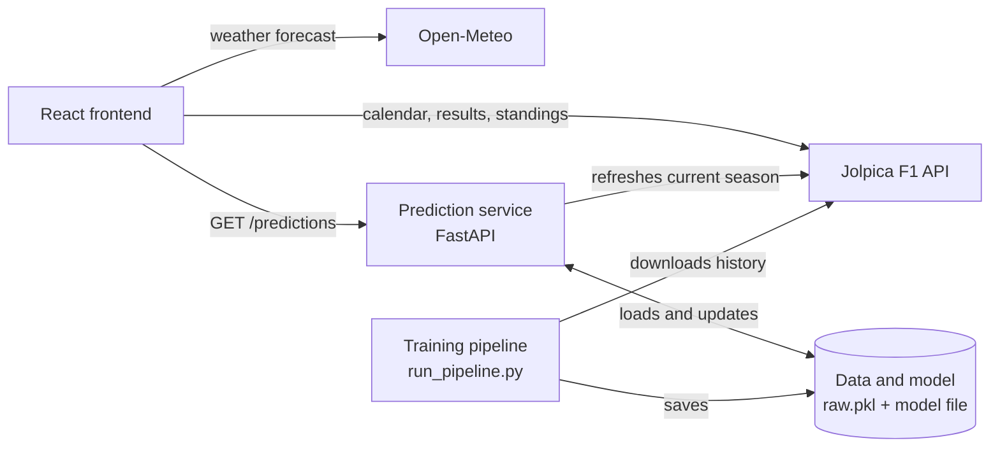
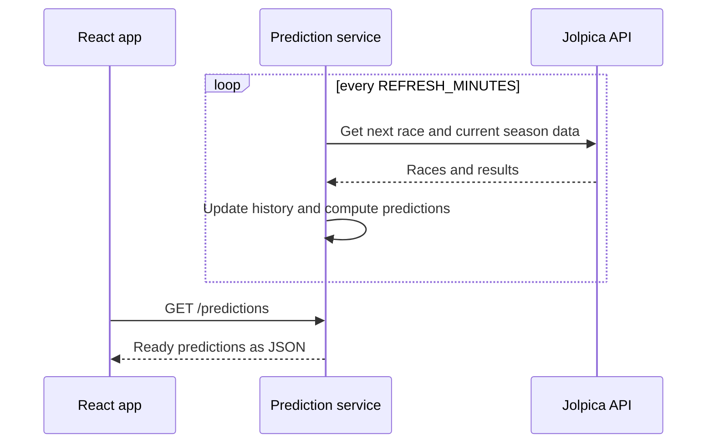

# F1 Hub

A Formula 1 web application built with **React.js** and **TypeScript**, backed by a small **Python prediction service** (FastAPI + scikit-learn). It brings together race calendars, race results, driver profiles and championship standings in one place, along with a live countdown to the next Grand Prix, a weather forecast for the upcoming race and **machine-learning predictions of how the next race will finish**.

## Table of Contents

- [Features](#features)
- [Tech Stack](#tech-stack)
- [System Architecture](#system-architecture)
- [Prediction Service](#prediction-service)
- [Data Sources](#data-sources)
- [Getting Started](#getting-started)
- [Project Structure](#project-structure)
- [Notes](#notes)
- [Acknowledgements](#acknowledgements)

## Features

### Home

- Countdown to the **next race**
- **Podium** of the most recent race
- **Top 5 drivers** in the current season standings
- **Top 5 constructors** in the current season standings

### Race Calendar

- Full list of races in the season with their dates
- Winner shown for every race that has already taken place
- Season progress: number of rounds completed and rounds remaining

### Race Details

- Race info: location, date, circuit, circuit details, circuit image, race distance, lap record, number of laps and more
- **Results table** (for completed races) showing:
  - driver and constructor
  - driver's fastest lap
  - grid position
  - difference between grid and final position
  - race time / gap
  - points
- Fastest lap of the race
- **7-day weather forecast** for the next upcoming race (when the race hasn't taken place yet)

### Race Predictions

- For the **next race**, the probability of every driver finishing **P1**, on the **podium**, in the **top 5** and in the **top 10**
- Predictions come from a machine-learning model served by a separate API (see [Prediction Service](#prediction-service))
- Table sorted by win probability, with the race name, round and the date the predictions were last refreshed

### Drivers

- Card list of all drivers in the current season

### Driver Details

- Photo, nationality (with flag), driver code, car number, full name and current constructor
- Link to the driver's Wikipedia page
- Age and date of birth
- Career totals: **wins**, **podiums** and **pole positions**
- **Stats by season**: wins, podiums, pole positions, points and the constructor driven for in each season

### Standings

- Current **Drivers'** and **Constructors'** championship standings
- Historical standings for several previous seasons

## Tech Stack

### Frontend

- [React.js](https://react.dev/)
- [TypeScript](https://www.typescriptlang.org/)
- [Vite](https://vite.dev/)
- [Axios](https://axios-http.com/) (API layer)
- HTML5
- CSS3

### Prediction service

- [Python](https://www.python.org/) 3.10+
- [FastAPI](https://fastapi.tiangolo.com/) + [Uvicorn](https://www.uvicorn.org/) (HTTP API)
- [pandas](https://pandas.pydata.org/) and [NumPy](https://numpy.org/) (data and feature engineering)
- [scikit-learn](https://scikit-learn.org/) (models, evaluation)
- [joblib](https://joblib.readthedocs.io/) (model persistence)
- [Requests](https://requests.readthedocs.io/) (Jolpica client)

## System Architecture

The **React frontend** reads calendar, results, standings and weather directly from the **Jolpica** and **Open-Meteo** APIs. Only predictions come from the separate **prediction service**, which uses a model trained offline by the **training pipeline**.



### How a prediction request works

A request never triggers calls to Jolpica and never runs the model. All the heavy work happens in a background loop, so the endpoint answers immediately with the last computed result.



### Design decisions

- **Predictions are precomputed.** Fetching a season takes roughly 10 API calls and scoring takes a moment, but the data only changes after a race. The service refreshes in the background and serves the finished snapshot, so response time does not depend on Jolpica and the frontend cannot cause rate limiting.
- **History is downloaded once.** The full history (2013 onward) is fetched a single time and kept in `raw.pkl`. Afterwards only the current season is refreshed, which keeps the number of requests small (Jolpica limits requests to roughly 4 per second in bursts and about 500 per hour).
- **No database.** Raw data is stored as pandas DataFrames in memory and persisted to a single pickle file. The file is overwritten atomically (write to a temporary file, then rename), so a crash can never leave a half-written file.
- **Snapshot replacement.** The prediction snapshot is replaced as a whole, never modified in place, so a request always sees a consistent result.
- **Resilience.** If a refresh fails (e.g. Jolpica is unavailable), the service keeps serving the previous predictions and reports the error in `/health`.
- **Frontend independence.** The existing app keeps reading calendar, results and standings straight from Jolpica. Only predictions go through the new service.

## Prediction Service

For every driver in the next Grand Prix, the service estimates the probability of finishing **P1**, on the **podium**, in the **top 5** and in the **top 10**. Each of the four targets is a separate binary classifier.

### Model

- **Data:** race and sprint results from Jolpica (2013 onward), loaded into pandas DataFrames.
- **Features (25):** computed only from races that have already taken place, so a race never sees its own result. They cover driver form (recent finishing positions, points, win/podium and DNF rates), circuit history, team strength and reliability, championship standings before the race, and context (round number, sprint weekend, regulation era).
- **Split:** temporal, never random. Train 2014–2023, validation 2024, test 2025+ (2013 is warm-up).
- **Models compared:** a one-feature baseline, logistic regression, random forest, gradient boosting and a small MLP. The four real models perform similarly; **random forest** is used. It has about 5% lower log loss than the baseline (test: 0.305 vs 0.322).
- **Production model:** the chosen model is refit on all available data and saved with `joblib`.
- **Post-processing:** probabilities are adjusted so that, across the field, they sum to 1, 3, 5 and 10, and `win ≤ podium ≤ top5 ≤ top10` holds for every driver.

The driver list for the next race is taken from the most recent race in the data. Results in Formula 1 are noisy, so treat the output as an estimate, not a forecast.

### API

- `GET /predictions` returns the ready predictions for the next race. It responds with `503` and `Retry-After: 15` until the first predictions are computed.
- `GET /health` returns `status` (`starting` or `ok`), the time of the last update and the last refresh error, if any.

```json
{
  "race": {
    "season": "2026",
    "round": "17",
    "raceName": "Singapore Grand Prix",
    "circuitId": "marina_bay",
    "date": "2026-10-11",
    "isSprint": true
  },
  "model": {
    "name": "random_forest",
    "featureSet": "pre_quali",
    "trainedThrough": "2026 R16"
  },
  "dataThrough": "2026 R16",
  "updatedAt": "2026-10-05T19:44:26+00:00",
  "warning": null,
  "predictions": [
    {
      "driverId": "antonelli",
      "driverCode": "ANT",
      "constructorId": "mercedes",
      "win": 0.39,
      "podium": 0.67,
      "top5": 0.82,
      "top10": 0.91
    }
  ]
}
```

Probabilities are numbers from 0 to 1, sorted by `win`. `warning` is non-null when a race before the predicted one is missing from the data.

### Configuration

| Variable          | Default                   | Description                                                    |
| ----------------- | ------------------------- | -------------------------------------------------------------- |
| `MODEL_PATH`      | `models/pre_quali.joblib` | Trained model produced by `run_pipeline.py`                    |
| `RAW_PICKLE`      | `raw.pkl`                 | Raw data file; the service refreshes and overwrites it         |
| `START_SEASON`    | `2013`                    | First season, used only when all data has to be downloaded     |
| `REFRESH_MINUTES` | `60`                      | How often data and predictions are refreshed in the background |
| `CORS_ORIGINS`    | `http://localhost:5173`   | Allowed frontend origins, comma-separated                      |

### Keeping it up to date

Data refreshes automatically while the service runs. The model does not retrain by itself: retrain it from time to time (e.g. every 4–5 races and at the start of a season) using the command in [Training the model](#training-the-model), then restart the service.

## Data Sources

### APIs

| Service                                                 | Purpose                                                                                                |
| ------------------------------------------------------- | ------------------------------------------------------------------------------------------------------ |
| [Jolpica F1 API](https://github.com/jolpica/jolpica-f1) | All Formula 1 data: races, results, drivers, constructors, standings; also training data for the model |
| [Open-Meteo](https://open-meteo.com/)                   | Weather forecast for the upcoming race (7 days ahead)                                                  |
| [Flag CDN](https://flagpedia.net/download/api)          | Country flags for drivers' nationalities and race host countries                                       |

### Images

| Images         | Source                     |
| -------------- | -------------------------- |
| Circuit images | Official Formula 1 website |
| Driver photos  | Sky Sports                 |

Images were downloaded from these sources and are stored locally in the project (they are not fetched at runtime).

## Getting Started

### Prerequisites

- [Node.js](https://nodejs.org/) (LTS recommended) and npm
- [Python](https://www.python.org/) 3.10 or newer (only for the prediction service)

### 1. Frontend

```bash
# Clone the repository
git clone https://github.com/<your-username>/<repository-name>.git
cd <repository-name>

# Install dependencies
npm install
```

Create a `.env` file in the project root so the app knows where the prediction service runs:

```
VITE_PREDICTIONS_API_URL=http://localhost:8000
```

Start the development server:

```bash
npm run dev
```

The app will be available at `http://localhost:5173` (or the port shown in your terminal). Everything except the predictions works without the prediction service.

### 2. Prediction service

Run these commands from the `predictor/` folder.

**Create a virtual environment and install dependencies**

```bash
cd predictor
python -m venv .venv
```

Activate it:

```bash
# macOS / Linux
source .venv/bin/activate
```

```powershell
# Windows (PowerShell)
.venv\Scripts\Activate.ps1
# if scripts are blocked:
# Set-ExecutionPolicy -Scope Process -ExecutionPolicy Bypass
```

```bash
python -m pip install -r requirements.txt
```

#### Training the model

The first run downloads the history of all seasons from 2013 (a few minutes, rate-limited) into `raw.pkl`, trains the models, prints validation and test metrics and saves the chosen model. Later runs reuse `raw.pkl` and do not download anything again.

```bash
python run_pipeline.py --raw-pickle raw.pkl --model random_forest --save-model models/pre_quali.joblib
```

#### Running the service

```bash
python -m uvicorn main:app --port 8000
```

Check `http://localhost:8000/health`: it reports `starting` for a few seconds and then `ok`. Predictions are available at `http://localhost:8000/predictions`. On Windows, `python -m uvicorn` works even if `uvicorn` is not on your PATH.

To change settings, set the environment variables from [Configuration](#configuration) before starting, for example:

```powershell
# Windows (PowerShell)
$env:REFRESH_MINUTES = "360"
python -m uvicorn main:app --port 8000
```

```bash
# macOS / Linux
REFRESH_MINUTES=360 python -m uvicorn main:app --port 8000
```

#### Command-line prediction (optional)

To print the predictions for the next race without starting the service:

```bash
python predict_next.py --model models/pre_quali.joblib --raw-pickle raw.pkl
```

### Build for production

```bash
npm run build
```

The prediction service has no deployment setup or authentication yet; it is intended for local use.

## Project Structure

```
├── public/               # Static files
├── src/
│   ├── api/              # API layer (Jolpica, Open-Meteo, prediction service)
│   ├── assets/           # Locally stored circuit and driver images
│   ├── components/       # Reusable UI components
│   ├── constants/        # Shared constants
│   ├── hooks/            # Custom React hooks
│   ├── pages/            # Home, Races, RaceDetails, Drivers, DriverDetails, Standings, Predictions
│   ├── types/            # TypeScript types and interfaces
│   ├── utils/            # Helper functions
│   ├── App.tsx           # Root component and routing
│   └── main.tsx          # Application entry point
├── predictor/            # Prediction service (Python)
│   ├── main.py           # FastAPI app: endpoints, in-memory state, background refresh
│   ├── f1_data.py        # Jolpica client: pagination, retries, DataFrames
│   ├── f1_features.py    # Feature engineering, targets, temporal split, upcoming-race rows
│   ├── f1_models.py      # scikit-learn models, ModelBundle save/load
│   ├── f1_eval.py        # Metrics, calibration, probability normalization
│   ├── f1_predict.py     # Predictions for the next race
│   ├── run_pipeline.py   # Training pipeline: download → features → split → train → evaluate → save
│   ├── predict_next.py   # Command-line prediction
│   └── requirements.txt  # Python dependencies
└── index.html            # HTML entry point
```

## Notes

- The Jolpica API enforces rate limits (including a small burst limit), so requests are kept to a minimum where possible. The prediction service retries with backoff when it receives HTTP 429.
- Weather forecasts are only displayed for the next upcoming race, as Open-Meteo provides a 7-day forecast window.
- Predictions are estimates from a statistical model trained on past results. They do not account for information outside the data (weather, penalties, technical updates, driver changes), and the model is only moderately better than a naive baseline.
- After a restart the service needs a few seconds to prepare the first predictions; the frontend should retry on `503`.

## Acknowledgements

- [Jolpica F1](https://github.com/jolpica/jolpica-f1) for the open Formula 1 data API
- [Open-Meteo](https://open-meteo.com/) for the free weather API
- [Formula 1](https://www.formula1.com/) and [Sky Sports](https://www.skysports.com/) for the circuit and driver imagery

## Disclaimer

This is an unofficial fan project and is not affiliated with, endorsed by, or associated with Formula 1, the FIA, or any F1 team. All trademarks and images belong to their respective owners.
